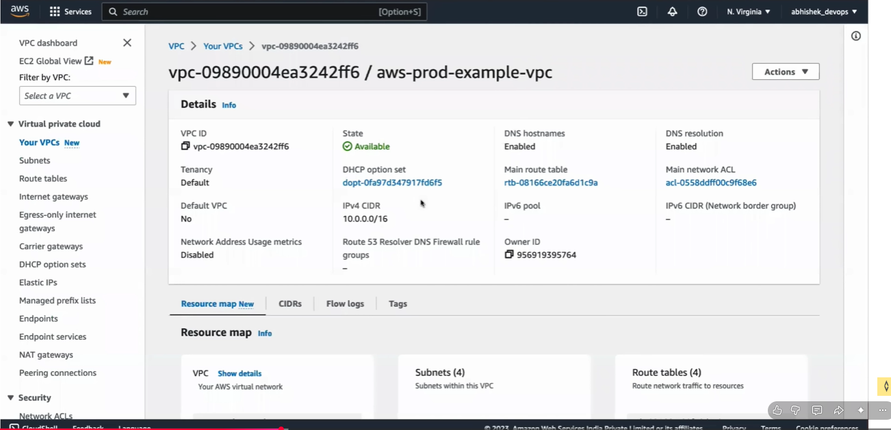
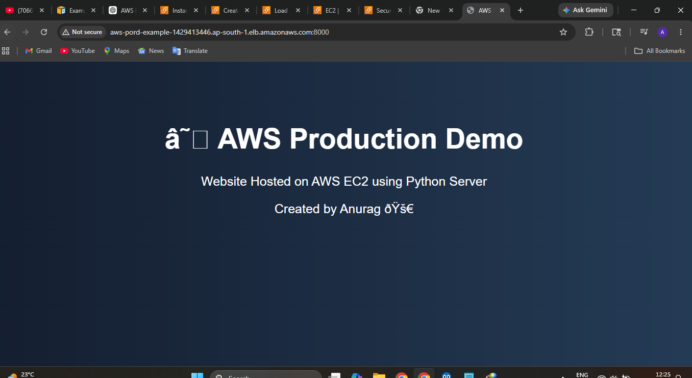
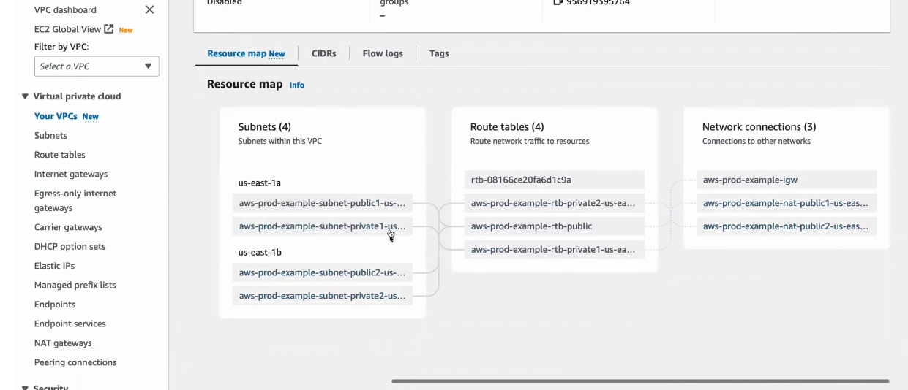
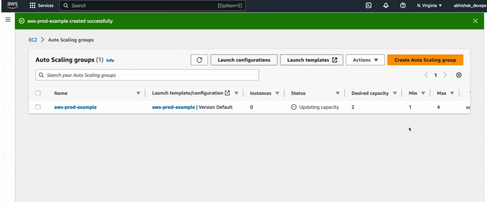
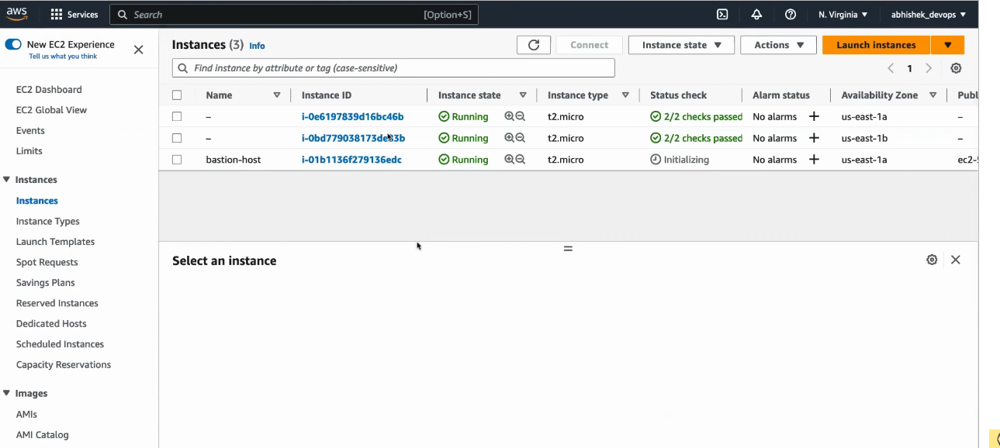
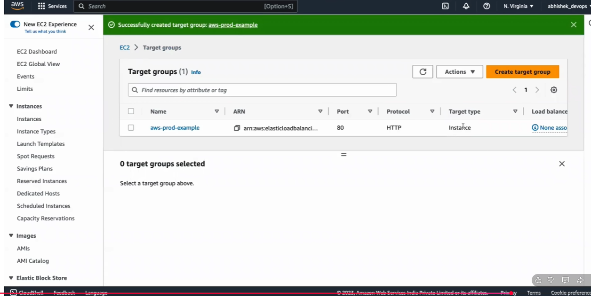
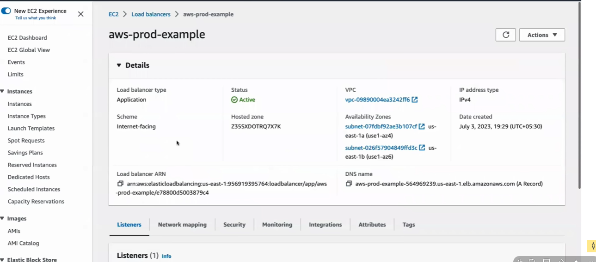

# AWS Production VPC Architecture Project

This project demonstrates a production-style AWS architecture using VPC, public subnet, private subnet, Bastion Host, NAT Gateway, Auto Scaling Group, Target Group, and Application Load Balancer.

## Architecture

User traffic flows through the Application Load Balancer and reaches EC2 instances running inside private subnets.

```
User
 ↓
Internet Gateway
 ↓
Application Load Balancer
 ↓
Target Group
 ↓
Private EC2 Instances
```

Admin access flow:

```
Laptop
 ↓
Bastion Host
 ↓
Private EC2 Instance
```

Private EC2 internet access flow:

```
Private EC2
 ↓
NAT Gateway
 ↓
Internet
```

## AWS Services Used

- Amazon VPC
- Public Subnet
- Private Subnet
- Internet Gateway
- NAT Gateway
- EC2
- Bastion Host
- Auto Scaling Group
- Launch Template
- Target Group
- Application Load Balancer
- Security Groups

## Project Steps

1. Created a custom VPC.
2. Created public and private subnets across two Availability Zones.
3. Created NAT Gateway for private EC2 internet access.
4. Created Auto Scaling Group for EC2 instances.
5. Launched application servers in private subnets.
6. Created Bastion Host in public subnet for SSH access.
7. Hosted a simple HTML website using Python HTTP server.
8. Created Target Group for EC2 instances.
9. Created Application Load Balancer to route traffic.
10. Accessed the website using Load Balancer DNS.

## Website

The website was hosted using:

```bash
python3 -m http.server 8000
```

## Important Security Note

PEM files, AWS access keys, and secret credentials should never be uploaded to GitHub.

## Learning Outcome

Through this project, I learned how production applications are deployed securely in AWS using private subnets, Bastion Host, NAT Gateway, Auto Scaling Group, and Load Balancer.

## Created By

Anurag Naithani

## Screenshots

### VPC Architecture



### Load Balancer


### Website Output




## Screenshots

### Website Output


### VPC


### Subnets



### Auto Scaling Group



### EC2 and Bastion Host



### Target Group



### Load Balancer




## Screenshots

### Website Output


### VPC


### Subnets


### Auto Scaling Group


### EC2 and Bastion Host


### Target Group


### Load Balancer


